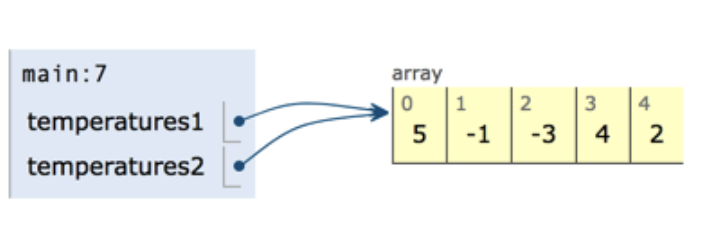

# 4.2 Working With Arrays

* [Arrays as Reference Data Types](https://github.com/SACHSTech/ICS3U1_lesson_4_2_WorkingWithArrays/edit/main/README.md#arrays-as-reference-data-types)
* [Processing Arrays with Loops](https://github.com/SACHSTech/ICS3U1_lesson_4_2_WorkingWithArrays/edit/main/README.md#processing-arrays-with-loops)


## Arrays as Reference Data Types
Arrays in Java are reference data types.  This means that, like objects, the array variable holds a reference to the data in the array, not the arrays' data itself.

Consider an array temperatures.  The variable temperatures is a reference to the data.

```
public class Temperatures extends ConsoleProgram {


    public void run() {
      
      int[] temperatures1 = {5, -1, -3, 4, 2};
      int[] temperatures2 = {7, 6, 5, 8, 7};

      temperatures2 = temperatures1;
      System.out.println(temperatures1[1]);
      System.out.println(temperatures2[1]);
    }
}
```


I can change my second list to refer to the first:
```
temperatures2 = temperatures1;
```


The effect of this is temperature1 & 2 now refer to the same array.  The result of the program above is 
```
-1
-1
```

## Processing Arrays with Loops

### Reading in Values
We've seen that we can initialize array elements with an initializer.  We can also use user input to set element values:

```
int[] marks = new int[5];

       for (int index = 0; index < 5; index++){
            
           System.out.print("Enter a mark: ");
           marks[index] = scanner.nextInt();
       }

```


